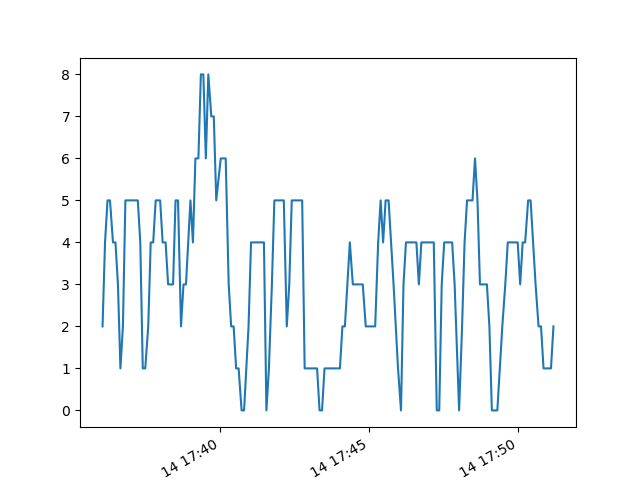

# HW-Mini-Project-2021
Hardware mini project for EC463 Fall 2021 by Ammar Hussain and Ian McFarlin
Hardware Mini Project
Ammar Hussain & Ian McFarlin
09/17/2021
EC463

Introduction
In this project, the main objective was to gain experience with the Raspberry Pi and explore some of its capabilities that will potentially be of use in the future with the main senior design project. Specifically with the general setup of the Raspberry Pi and collecting and observing data from the Bluetooth and Wifi sensors. 

Results
The plot in figure 1 displays the number of WiFi networks detected by the Raspberry Pi on the y-axis over a 15 minute period on the x-axis. The maximum number detected was 8 networks roughly at 3 minutes from the start, which was at 5:39 pm. The minimum number of networks detected was zero seven times, although each time was only for a brief period. As mentioned in the provided code, stationary networks were excluded from the plot, hence why the three BU networks were not included. 

Figure 1: Plot generated by the wifi_plot.py script reading in the .json file generated by wifi_scan.py, showing gathered data over 15 minutes. 

Explanations/Difficulties/Discussion
To begin, it was necessary to properly set up the Raspberry Pi by connecting it to the provided peripherals in the lab. At first, the monitor was not displaying anything despite the Raspberry Pi being properly connected to the monitor, power supply, keyboard, and mouse. This was quickly resolved by unplugging the power and plugging it back in. Once this was fixed, there were no additional hardware issues with the setup. By following the provided guide on GitHub, the Raspberry Pi was able to scan for both nearby Bluetooth devices and WiFi networks.  Despite the goal of recognizing automobile hotspots, the Raspberry Pi scanner was unable to detect any passing hotspots. Seen in figure 1 is the plot generated by the given script wifi_plot.py which took in data generated by the other provided script wifi_scan.py. The wifi_plot.py script was initially not working on both the Raspberry Pi and the computers, so a couple lines was added to the code: one to import matplotlib.pyplot, and another at the end of the code to actually show the plot, from where the plot could be saved. Based on the collected data, it can be assumed that relatively few vehicles have active hotspots, hence the lack of detection. 

Conclusion
From this experience, the Raspberry Pi system was learned to be able to work with, as well as some of the quirks that are involved in such a project. Throughout this project necessary experience was gained such that it will help and be essential moving forward into the future of the main Senior Design projects of the coming year. 

